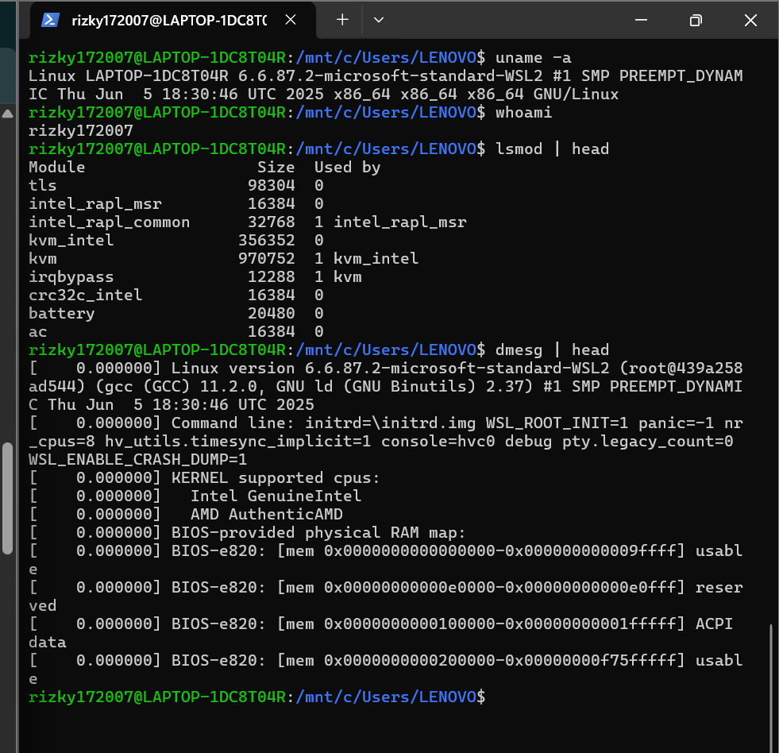

# Laporan Praktikum Minggu 1
Topik: Arsitektur Sistem Operasi

---

## Identitas
- **Nama**  : Rizky Iqbal Hisyam 
- **NIM**   : 250202926
- **Kelas** : 1IKRA

---

## Tujuan
1. Dapat  memahami peran sistem operasi
2. Mengetahui komponen utama OS seperti kernel, system call, dan file system
3. Mengetahui model-model arsitektur OS yaitu monolithic kernel, layered, dan microkernel, serta mengetahui contoh-contohnya
4. Dapat menjalankan command line di terminal
---

## Dasar Teori
Interface/antarmuka sistem tidak hanya Graphical User Interface (GUI), ada juga Command Line Interface (CLI) seperti Linux. Terminal Linux adalah antarmuka yang berbasis teks yang digunakan untuk berinteraksi dengan OS melalui perintah/command. CLI memiliki kelebihan dibanding dengan GUI, yaitu lebih ringan, lebih cepat, dan dapat memberikan control penuh terhadap system.

---

## Langkah Praktikum
1. Menginstal Linux (Ubuntu/WSL)
2. Mencoba eksperimen dasar dengan menjalankan beberapa perintah seperti berikut:
```bash
   uname -a
   whoami
   lsmod | head
   dmesg | head
   ```
3. Screenshot dan catat hasilnya 

---

## Kode / Perintah

```bash
uname -a
lsmod | head
dmesg | head
```

---

## Hasil Eksekusi
Screenshot hasil percobaan:


---

## Analisis
**- Makna dari hasil percobaan WSL yaitu:**
1. Identitas sistem (kernel yang digunakan, arsitektur, mode:WSL2)
2. User aktif (login sebagai user non-root “rizky172007”)
3. Hasil dari “lsmod | head” sebagai berikut:

| Modul                  | Fungsi                                           | Keterangan                                                                                                            |
| :--------------------- | :----------------------------------------------- | :-------------------------------------------------------------------------------------------------------------------- |
| **tls**                | Transport Layer Security                         | Modul kernel untuk enkripsi data pada koneksi jaringan.                                                               |
| **intel_rapl_msr**     | Intel RAPL (Running Average Power Limit)         | Untuk memantau dan mengontrol konsumsi daya prosesor Intel.                                                           |
| **kvm_intel**          | Kernel-based Virtual Machine untuk Intel         | Komponen virtualisasi hardware Intel (VT-x). Di WSL2 ini hanya dimuat sebagai *placeholder*, bukan benar-benar aktif. |
| **kvm**                | Kernel Virtual Machine                           | Lapisan utama virtualisasi kernel Linux. Di WSL2 digunakan untuk kompatibilitas, bukan virtualisasi langsung.         |
| **irqbypass**          | Interrupt Bypass Manager                         | Mengoptimalkan performa interrupt pada sistem virtualisasi.                                                           |
| **crc32c_intel**       | Intel hardware acceleration untuk hashing CRC32C | Digunakan untuk verifikasi data.                                                                                      |
| **battery** dan **ac** | Modul daya                                       | Meniru informasi daya dari sistem host (Windows). Berguna untuk tool seperti `upower` atau `acpi`.                    |

4. Hasil  dari “dmesg | head” yaitu log tersebut menegaskan bahwa sistem Linux tidak berjalan langsung di hardware, tetapi di dalam lapisan virtualisasi WSL2 berbasis Hyper-V.
Kernel dan memori sepenuhnya dikendalikan oleh Windows.

**- Hubungkan hasil dengan teori (fungsi kernel, system call, arsitektur OS).**
Dari hasil tersebut dapat disimpulkan bahwa:
1. Kernel Linux WSL2 menjalankan fungsinya dalam management sistem
2. Interaksi antara user dan kernel terjadi melui System Call
3. Struktur sistem mencerminkan layered architecture dan hybrid sesuai teori Silberschatz dan Tanenbaum.

**- Apa perbedaan hasil di lingkungan OS berbeda (Linux vs Windows)?**  
Linux (WSL2) memberikan transparansi dan control penuh terhadap kernel melalui perintah user (command), sedangkan Windows memberikan kenyamanan bagi pengguna melalui GUI (Graphic User Interface) dan sitem kernel yang tertutup.

---

## Kesimpulan
Kesimpulan yang bisa didapatkan dari praktikum ini adalah OS Windows dan Linux memiliki perbedaan dari segi karakteristik dan cara penggunaannya. Windows menggunakan sistem antarmuka GUI yang lebih tertutup, sedangkan Linux dapat menghubungkan langsung antara user dengan kernel melalui perintah /command (CLI).

---

## Quiz
1. Sebutkan tiga fungsi utama sistem operasi.

   **Jawaban:**  
Fungsi utama sistem operasi yaitu manajemen proses, manajemen memori, dan manajemen input/output (I/O)
2. Jelaskan perbedaan antara kernel mode dan user mode.

   **Jawaban:**  
Kernel mode memiliki akses penuh ats hardware dan memori sistem, sedangkan user mode memiliki akses terbatas  dan harus meminta izin dari OS melalui system call untuk melakukan operasi. 
3. Sebutkan contoh OS dengan arsitektur monolithic dan microkernel.

   **Jawaban:**  
Contoh OS monolithic yaitu UNIX (versi awal), MS-DOS, dan Linux. 
Sedangkan OS dengan microkernel yaitu MINIX 3(dirancang langsung oleh Andrew S. Tanenbaum), QNX, dan Mach (dasar iOS dan macOS)

---

## Refleksi Diri
Tuliskan secara singkat:
- Apa bagian yang paling menantang minggu ini? 

Yang paling menantang menurut saya adalah sistem pengumpulan tugas melalui github untuk pertama kali. 
- Bagaimana cara Anda mengatasinya?  

Tentunya dengan memperhatikan cara-cara yang diberikan dosen dan mempraktikkannya dengan baik serta mencari cara sendiri melalui berbagai sumber.

---

**Credit:**  
_Template laporan praktikum Sistem Operasi (SO-202501) – Universitas Putra Bangsa_
