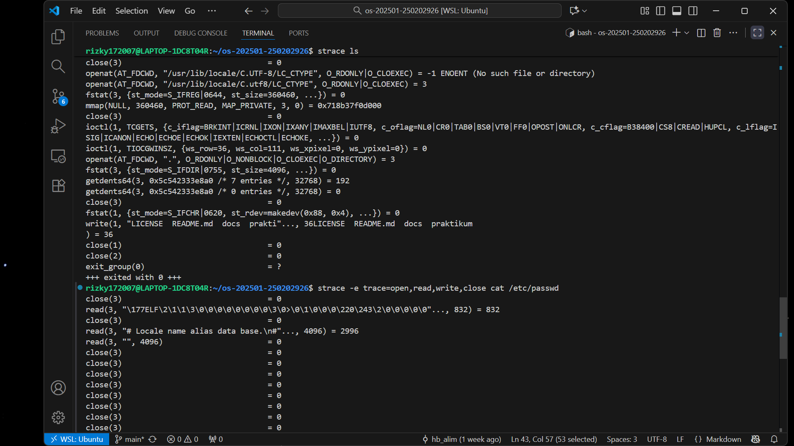
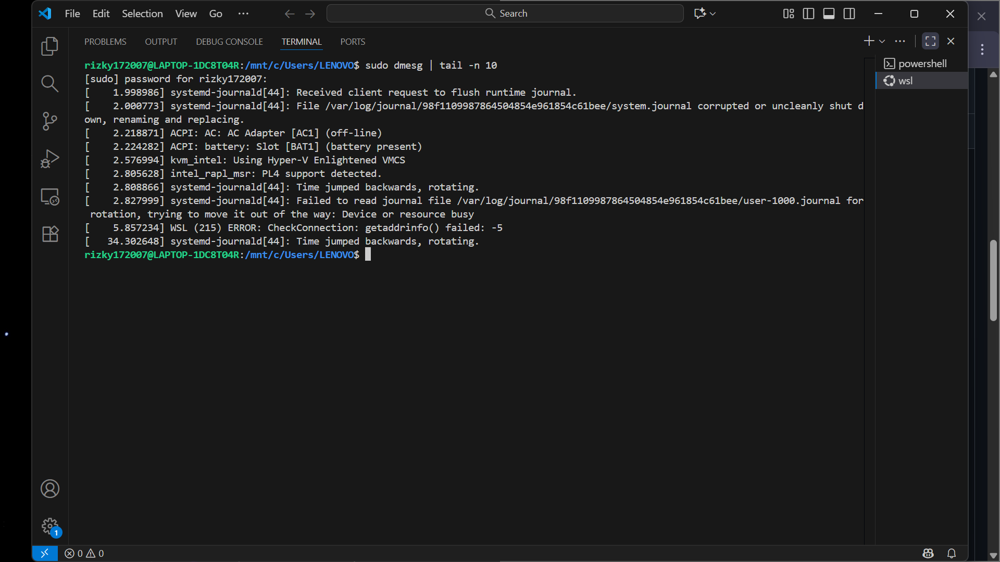
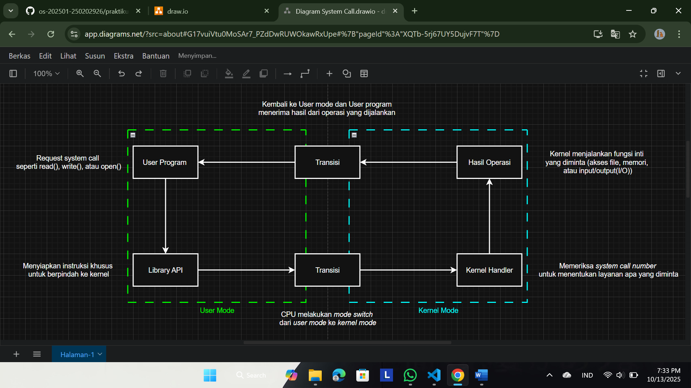

# Laporan Praktikum Minggu 2
Topik: Struktur System Call dan Fungsi Kernel

---

## Identitas
- **Nama**  : Rizky Iqbal Hisyam  
- **NIM**   : 250202926
- **Kelas** : 1IKRA

---

## Tujuan
1. Mampu menjelaskan konsep dan fungsi system call dalam sistem operasi.
2. Dapat mengidentifikasi jenis-jenis system call dan fungsinya.
3. Mengamati alur perpindahan mode user ke kernel saat system call terjadi.
4. Mampu menggunakan perintah Linux untuk menampilkan dan menganalisis system call.
---

## Dasar Teori
Ketiga percobaan ini memperlihatkan hubungan antara user dengan kernel melalui system call. Percobaan strace ls menunjukkan bagaimana perintah pengguna berinteraksi dengan kernel melalui system call untuk mengakses file system. Perintah kedua untuk membaca isi file dan menampilkannya ke terminal, menunjukkan proses I/O dasar dalam operating system dimana aplikasi mengakses file melalui system call. Sedangkan percobaan terakhir menunjukkan bagaimana kernel mencatat  aktivitas sistem dan hardware.

---

## Langkah Praktikum
1. Gunakan Linux (Ubuntu/WSL) dan pastikan perintah strace dan man sudah terinstall
2. Jalankan perintah "strace ls", analisi dan catat hasilnya
3. Jalankan perintah "strace -e trace=open,read,write,close cat /etc/passwd" dan analisis
4. Lalu jalankan perintah "dmesg | tail -n 10" dan amati output yang keluar
5. Catat dan analisis semua hasil perintah diatas dalam bentuk tabel observasi

---

## Kode / Perintah
Tuliskan potongan kode atau perintah utama:
```bash
strace ls
strace -e trace=open,read,write,close cat /etc/passwd
sudo dmesg | tail -n 10
```

---

## Hasil Eksekusi
Screenshot hasil percobaan dan diagram:




---

## Analisis


| No. | Perintah yang Dijalankan                            | System Call yang Muncul                                             | Hasil/Output                                                                                                                             | Sumber Referensi                                                                                                                                                   |                                                                                                                                                             |
| ------- | ------------------------------------------------------- | ------------------------------------------------------------------------- | -------------------------------------------------------------------------------------------------------------------------------------------------------- | ---------------------------------------------------------------------------------------------------------------------------------------------------------------------- | ----------------------------------------------------------------------------------------------------------------------------------------------------------- |
| 1   | `strace ls`                                             | `execve()`, `openat()`, `read()`, `write()`, `close()`, `mmap()`, `brk()` | Terminal menampilkan daftar isi direktori. `strace` menunjukkan serangkaian system call yang digunakan oleh program `ls` untuk membaca dan menulis data. | Silberschatz, A., Galvin, P. B., & Gagne, G. (2018). *Operating System Concepts (10th Ed.)*, Wiley.                                                                    |                                                                                                                                                             |
| 2   | `strace -e trace=open,read,write,close cat /etc/passwd` | `open()`, `read()`, `write()`, `close()`                                  | Program `cat` menampilkan isi file `/etc/passwd` ke layar. `strace` memperlihatkan system call yang digunakan untuk membuka, membaca, dan menutup file.  | Tanenbaum, A. S., & Bos, H. (2015). *Modern Operating Systems (4th Ed.)*, Pearson. <br> Linux Manual Pages (`man 2 open`, `man 2 read`, `man 2 write`, `man 2 close`). |                                                                                                                                                             |
| 3   | `sudo dmesg  tail -n 10`                                                               | `open()`, `read()`, `write()`, `close() ` | Menampilkan log kernel terbaru seperti aktivitas perangkat, driver, serta informasi virtualisasi (Hyper-V pada WSL2).                                                                                                                                                                | *Operating System Concepts (10th Ed.)*, Wiley. <br> *Modern Operating Systems (4th Ed.)*, Pearson. <br> Linux Manual Pages (`man 1 dmesg`, `man 2 syslog`). |

System call bisa dibilang adalah “jembatan penghubung” antara pengguna dan sistem operasi. Saat menjalankan perintah di terminal seperti `ls` atau membuka file lewat program, sebenarnya tidak langsung berinteraksi dengan perangkat keras. Semua permintaan itu harus melewati sistem operasi melalui system call. Karena itulah, system call memegang peran penting dalam menjaga keamanan sistem. Semua aktivitas, mulai dari membaca file, menulis data, membuat proses baru, hingga mengatur jaringan, harus melewati lapisan system call yang diawasi kernel. Jadi, tidak sembarang program bisa melakukan tindakan yang berisiko terhadap keamanan sistem. Dalam praktiknya, ada banyak system call yang digunakan di Linux, dan sebagian besar berkaitan dengan pengelolaan file, proses, dan memori. Beberapa di antaranya adalah:
- `open()` untuk membuka file,
- `read()` untuk membaca isi file atau input,
- `write()` untuk menulis data ke file atau terminal,
- `fork()` untuk membuat proses baru,
- `execve()` untuk menjalankan program baru,
- serta `exit()` untuk menghentikan proses yang sedang berjalan.

Melalui system call seperti ini, sistem operasi dapat menjalankan tugas-tugas penting dengan cara yang aman dan terkontrol. Singkatnya, system call adalah lapisan pelindung yang memastikan sistem operasi tetap aman dan terkendali. Tanpa system call, komputer akan jadi sangat rentan terhadap kesalahan dan serangan. System call bukan hanya alat komunikasi antara pengguna dan kernel, tapi juga penjaga utama keamanan sistem di balik layar.

---

## Kesimpulan
Dari tiga percobaan yang telah dilakukan, dapat disimpulkan bahwa setiap perintah yang dijalankan di Linux sebenarnya melibatkan komunikasi antara program pengguna dan kernel melalui system call. Pada percobaan pertama (`strace ls`), menunjukkan bahwa ketika pengguna menjalankan program, kernel-lah yang bertanggung jawab untuk membuka file, membaca data dari disk, lalu menulis hasilnya ke layar. Pada percobaan kedua menunjukkan bahwa akses terhadap berkas di Linux selalu melalui kernel, bukan langsung oleh program. Sedangkan percobaan ketiga (`sudo dmesg | tail -n 10`) memperlihatkan bagaimana kernel mencatat setiap aktivitas penting sistem, seperti deteksi perangkat dan proses. Secara keseluruhan, ketiga percobaan ini memperlihatkan peran penting system call sebagai penghubung utama antara user mode dan kernel mode.

---

## Quiz
1. Apa fungsi utama system call dalam sistem operasi?  
   
   **Jawaban:** 
   Menyediakan akses ke layanan kernel, mengatur operasi I/O, manajemen proses, manajemen memori, dan manajemen file 
2. Sebutkan 4 kategori system call yang umum digunakan. 
   
   **Jawaban:**  Proses control (`fork()`, `exit()`), file management (`open()`, `read()`, `write()`), manajemen perangkat (`open()/close()`, `read()/write()`), dan informasi system (`uname()`)
3. Mengapa system call tidak bisa dipanggil langsung oleh user program? 
   
   **Jawaban:** Karena adanya perbedaan hak akses antara user mode dengan kernel mode, untuk menjaga keamanan sistem operasi, dan menyediakan abstraksi hardware agar program lebih mudah dikembangkan. 

---

## Refleksi Diri
Tuliskan secara singkat:
- Apa bagian yang paling menantang minggu ini?

Mempraktikkan strace ls dan pengoperasian Linux  
- Bagaimana cara Anda mengatasinya?  

Belajar melalui berbagai sumber

---

**Credit:**  
_Template laporan praktikum Sistem Operasi (SO-202501) – Universitas Putra Bangsa_
